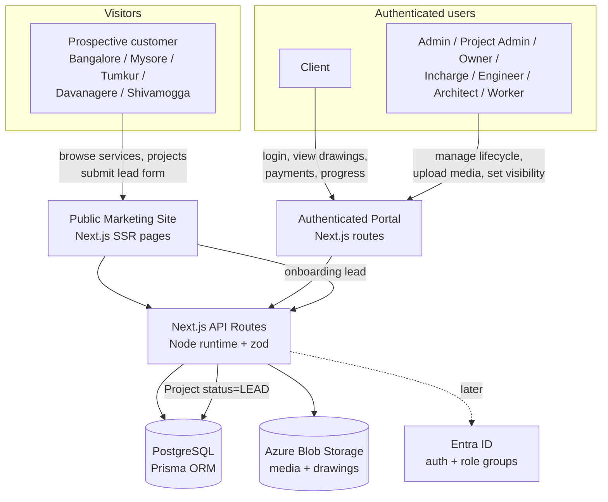
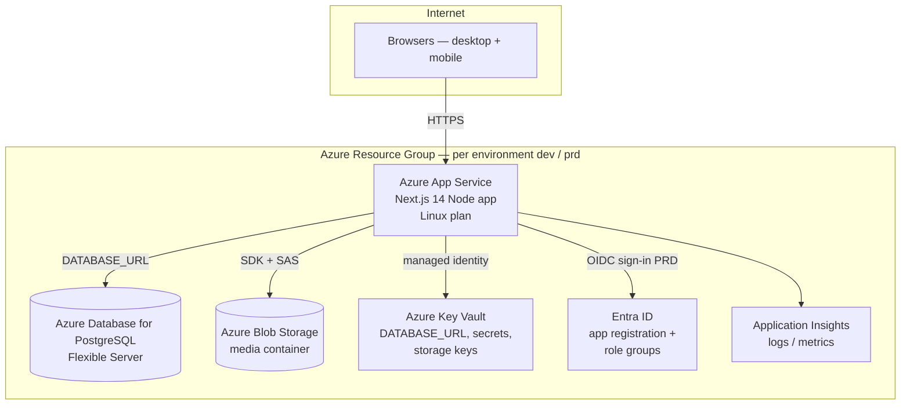
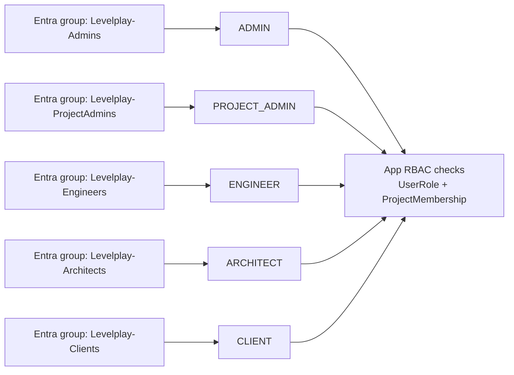
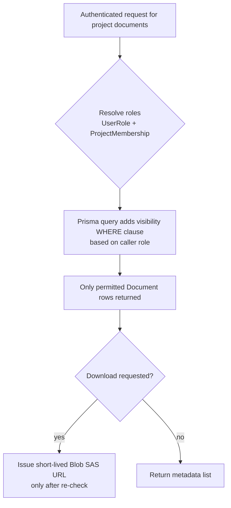

# Levelplay Constructions — High-Level Design (HLD)

> Digital platform for a Bangalore/Karnataka construction company. One Next.js 14 application serving a **public marketing website** and an **authenticated project-lifecycle portal**, backed by PostgreSQL + Prisma, with media in Azure Blob Storage. Roles are modeled to map 1:1 to Entra ID groups. Deployed to Azure via `azd up` across two environments (DEV = POC, PRD).

---

## 1. System Context

The platform is a single deployable Next.js 14 app (App Router, Node runtime) exposing two surfaces from the same codebase: a public SSR marketing site and an authenticated portal. Both share the API routes, the Prisma data layer, and Blob Storage for media.

**Key flow — lead to client:** a visitor submits the onboarding form on the public site → API creates a `Project` with `status = LEAD` (and a CLIENT `User` on conversion) → staff progress it through `ONBOARDING → DESIGN → IN_PROGRESS → HANDOVER → COMPLETED`.

---

## 2. Logical Components & Responsibilities

| Component | Responsibility |
|---|---|
| **Public Site module** | SSR marketing pages: services (home, apartment, commercial, interior, turnkey), city/area pages (Bangalore + Karnataka cities), showcase of ongoing/completed projects, onboarding lead-capture form. SEO-friendly, fast, mobile-first. |
| **Portal module** | Authenticated UI for the full project lifecycle: requirements, design discussions, payments, documents/media, deliveries, progress, handover. |
| **API layer (route handlers)** | All reads/writes. zod-validates every input. Enforces authentication, RBAC, and document **visibility** filtering before returning data. |
| **Auth & session service** | POC: validates bcrypt password hashes against seeded `User` records, issues a session. PRD: delegates to Entra ID; maps Entra group membership → `RoleName`. |
| **RBAC / authorization service** | Resolves a user's global `UserRole`s and per-project `ProjectMembership` capacity, then authorizes each action and filters query results by visibility. |
| **Project lifecycle service** | Owns `Project` status transitions, requirements capture, `ProjectMembership`. |
| **Design & document service** | CRUD over `Document` (floor plans, electrical/plumbing/structural drawings, site photos, progress videos, suggestions, contracts, invoices). Owns the visibility tag and Blob upload/download (SAS URLs in Azure). |
| **Payment service** | Payment milestones, status, references — the transparency/audit trail clients can see. |
| **Delivery & item-request service** | `DeliveryItem` tracking and `ItemRequest` raising/fulfilment. |
| **Handover service** | Handover summary, sign-off, completion. |
| **Data access layer** | Prisma client over PostgreSQL; single `DATABASE_URL`. |
| **Storage adapter** | POC: local path/URL in `Document.fileUrl`. PRD: Azure Blob Storage with short-lived SAS URLs. |

---

## 3. Technology Choices & Rationale

| Decision | Choice | Why (tied to this project) |
|---|---|---|
| App framework | **Next.js 14 App Router, Node runtime** | One framework serves the SSR marketing site (SEO + speed to attract customers) **and** the portal **and** the API routes — a single deployable, simplifying the Azure POC. Node runtime is required for Prisma and bcrypt. |
| Database | **PostgreSQL + Prisma** | Relational model fits the lifecycle entities (projects, memberships, payments, documents). Prisma gives typed access and migrations. Single `DATABASE_URL` swaps local → Azure with no code change. |
| Auth (POC) | **bcrypt-seeded users** | Lets us demo every role without provisioning Entra ID. `User.passwordHash` is POC-only and removed when Entra takes over. |
| Validation | **zod** | Server-side validation of the public lead form and all portal mutations; prevents bad data at the API boundary. |
| Media storage | **Azure Blob Storage** | Site photos/videos and large drawings do not belong in Postgres. `Document.fileUrl` already abstracts this — POC path becomes a Blob URL. |
| Roles model | **`RoleName` enum + `Role.azureAdGroupId`** | Roles are first-class and carry a slot for the Entra group object id, enabling a config-only swap to Entra ID later. |
| Deployment | **Azure App Service + Postgres Flexible Server + Blob + azd** | Managed PaaS keeps ops light for a small company; `azd up` makes DEV/PRD repeatable. |

---

## 4. Azure Target Architecture (DEV & PRD)

Both environments share the same topology and the same `azd` templates; they differ only in SKU/size, network exposure, and the auth provider. Each environment is an isolated resource group provisioned by `azd`.

**DEV (POC):** small SKUs (e.g. Burstable Postgres, Basic/Standard App Service plan); auth stays on seeded bcrypt users (Entra optional); public network access to Postgres restricted by firewall. Goal: demo to the construction company cheaply.

**PRD:** larger SKUs, zone-redundant/HA Postgres option, Postgres reachable via Private Endpoint/VNet, Entra ID enabled for real sign-in, geo-redundant Blob, alerting on App Insights. Provisioned only after the company procures.

Secrets (`DATABASE_URL`, storage keys) live in **Key Vault** and are read by App Service via **managed identity** — no secrets in source or app settings.

---

## 5. Environment Strategy & azd Mapping

- **Two `azd` environments:** `dev` (POC) and `prd`. Each is a named azd environment with its own `.azure/<env>` config and its own resource group, so infra is identical and reproducible.
- **`azd up`** provisions (App Service, Postgres Flexible Server, Blob, Key Vault, App Insights) and deploys the Next.js app in one step. `azd provision` / `azd deploy` separate the two when needed.
- **Per-environment config** (SKU sizes, Entra on/off, network exposure) is driven by azd environment variables / Bicep parameters — not by app code.
- **Single connection string contract:** the app only ever reads `DATABASE_URL` from app settings (sourced from Key Vault). Local dev points it at local Postgres; DEV/PRD point it at the respective Flexible Server.
- **Database migrations:** Prisma migrations are applied on deploy (`prisma migrate deploy`); `prisma/seed.ts` seeds roles and dummy users in DEV only.
- **Promotion path:** validate on DEV with seeded users → enable Entra ID → run the same `azd up` against `prd`.

---

## 6. Security & RBAC Model

**Roles** (`RoleName` enum): `CLIENT, ADMIN, PROJECT_ADMIN, PROJECT_OWNER, PROJECT_INCHARGE, ENGINEER, ARCHITECT, WORKER`. Each `Role` row carries `azureAdGroupId` (currently null).

**Two-level authorization:**
1. **Global role** via `UserRole` (a user may hold several, e.g. `ENGINEER` + `PROJECT_INCHARGE`).
2. **Per-project capacity** via `ProjectMembership.role` — a user can have a different role on each project. Data access is scoped to projects the user is a member of (except `ADMIN`/`PROJECT_ADMIN` who see across projects).

**Entra ID mapping (PRD, config-only swap):**

On Entra sign-in, the user's group object ids are matched against `Role.azureAdGroupId` to derive their `RoleName`s — no app logic changes, only data (`azureAdGroupId`) is populated. `User.passwordHash` is retired.

**Enforcement points:** authentication at the route handler; authorization (role + membership) before any mutation; visibility filtering on every document/media read; secrets in Key Vault; HTTPS only; zod validation at the API boundary to block malformed/over-posted input.

---

## 7. Document/Media Visibility Model

`Document.visibility` (`Visibility` enum) is the single source of truth, enforced **at every layer**, never trusted from the client:

| Visibility | Who can see |
|---|---|
| `CLIENT_VISIBLE` | The project's client **+** all internal staff (e.g. approved floor plans, progress photos, invoices). |
| `INTERNAL` | Staff only — project admins, incharge, engineers, architects, workers (e.g. working drawings, internal suggestions). |
| `ADMIN_ONLY` | Admins / project admins only (e.g. sensitive contracts, commercials). |

**Enforcement across layers:**

- **Data layer:** the existing `@@index([projectId, visibility])` supports efficient filtered reads. Every document query is constrained by `projectId` (membership) **and** a visibility set derived from the caller's role — a client query can only ever match `CLIENT_VISIBLE`.
- **API layer:** the route handler computes the allowed visibility set and applies it server-side; it is never passed by the client.
- **Storage layer:** Blob objects are private; access is only via short-lived **SAS URLs** minted *after* the visibility check, so a leaked URL expires and direct enumeration is impossible.
- **UI layer:** hides controls the user cannot use, but this is convenience only — the API/data checks are authoritative.

Uploaders (clients, project admins, workers, architects) set `kind` and `visibility` at upload; `uploadedBy` records provenance for audit.

---

## 8. Key Risks & Mitigations

| # | Risk | Impact | Mitigation |
|---|---|---|---|
| 1 | **Visibility bug exposes ADMIN_ONLY/INTERNAL docs to a client** | Trust/legal breach | Single enforcement helper applied to all document queries; visibility set derived server-side from role, never from client; private Blob + post-check SAS URLs; targeted tests per role × visibility. |
| 2 | **Auth swap (bcrypt POC → Entra ID) leaks or breaks** | Blocked PRD go-live | `azureAdGroupId` slot already in `Role`; auth isolated behind one service; group→role mapping is data-only; validate on DEV before PRD. |
| 3 | **Lead-form spam / abuse on public site** | Junk `LEAD` projects | zod validation, rate limiting, captcha, and a staff review step before `LEAD → ONBOARDING`. |
| 4 | **Large media (videos) cost/perf in App Service** | Slow uploads, cost | Direct-to-Blob uploads via SAS, size/mime checks (`sizeBytes`, `mimeType`), CDN for public showcase media. |
| 5 | **Secrets in config / source** | Compromise | Key Vault + App Service managed identity; no secrets in repo or plain app settings. |
| 6 | **Cross-project data leakage** | Wrong client sees another project | All queries scoped by `ProjectMembership`; admins explicitly broadened, everyone else constrained. |
| 7 | **`ItemRequest.requestedBy` is a loose string (POC)** | Weak audit trail | Acceptable for POC; tighten to a `User` FK before PRD for accountability. |
| 8 | **Single Postgres instance availability** | Portal downtime | DEV burstable acceptable; PRD uses HA/zone-redundant Flexible Server + automated backups. |
| 9 | **Payment data integrity / disputes** | Loss of client trust | `Payment.reference`, status, and timestamps form an audit trail; restrict edits to admin roles; never hard-delete. |
| 10 | **Public-site/portal coupling in one deployable** | A portal change risks the marketing site | Clear module separation, shared API contracts, App Insights monitoring, and staged DEV validation before PRD deploy. |